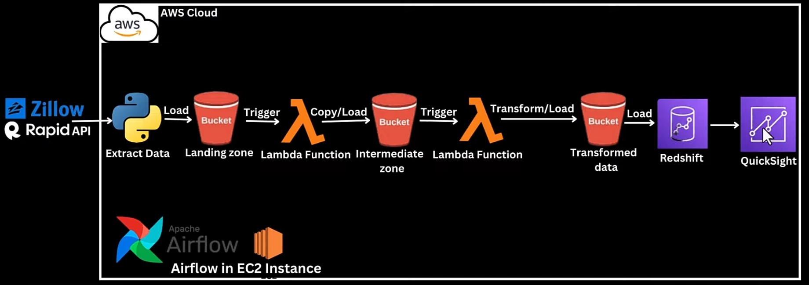

## Zillow End-to-End Data Engineering/ETL project on AWS.
(S3, Python, Pandas, AWS Lambda Function, Redshift Serverless , Airflow, Ec2, QuickSight)

The Aim of this project is to build an ETL pipeline which will Extract Zillow Real estate data using RapiAPI , Transform the data using Lambda function and make the data available in a Redshift data warehouse, to enable the data to be easily visaulized by end users or Data Analyst using QuickSight

### Below is the Data Flow diagram

The tools used includes:
1. AWS Lambda for hosting the Python extraction script and Extracting the Zillow real estate data 
2. AWS S3 for storage
3. Lambda was used again for transforming the data and selecting only required columns using Pandas
4. Amazon Redshift Serverless for data warehouse
5. AirFlow for Orchestration/Automation.
6. QuickSight for Visualization

In this project the data was copied directly from S3 to Redshift using S3ToRedshiftOperator Airflow operator

The DAG's are hosted on the EC2 instance which the Airflow is running on.

Once the data gets to Redshift Serverless, Any BI tool can be connected to it for visualization